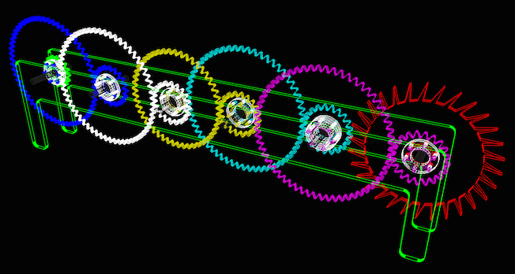

# Acrylic Pendulum Clock

This project includes some code to design, visualize, and laser-cut parts
of an acrylic pendulum clock. See the [full write-up](http://www.teamten.com/lawrence/projects/acrylic-pendulum-clock/).

The `clock.py` program generates a JSON file describing the parts of the
clock. Run it using this command:

    make json

You can then visualize it by starting a static web server:

    python -m SimpleHTTPServer

and visiting [`http://localhost:8000/`](http://localhost:8000/) with a modern
web browser, such as Chrome.

Run this command to convert the JSON file into an SVG file suitable for cutting
on a laser cutter:

    make cut
